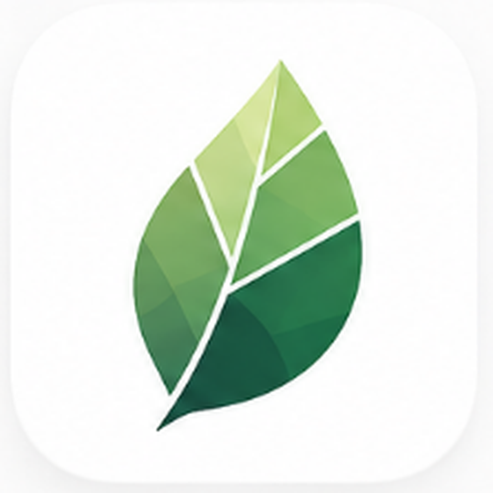

<div align="center">

# GeoSylva

### Application Android professionnelle d'inventaire forestier et de martelage

**Conçue par des forestiers, pour les forestiers.**
Inventaire terrain, martelage, cartographie et synthèse dendrométrique —
entièrement hors-ligne.

[](CHANGELOG.md)
[](https://developer.android.com)
[](https://kotlinlang.org)
[](https://github.com/NeooeN45/GeoSylva/actions/workflows/ci.yml)
[](LICENSE)

> **GeoSylva** est la spécialisation forestière de
> [**Quintessences**](https://github.com/NeooeN45/Quintessences) —
> écosystème d'intelligence environnementale propulsé par le moteur
> GSIE (General System Intelligence Engine).

---

[Pourquoi](#pourquoi-geosylva) · [Fonctionnalités](#fonctionnalités) · [Architecture](#architecture) · [Stack](#stack-technique) · [Installation](#installation) · [Tests](#tests) · [GSIE](#intégration-gsie-et-hub-geosylva) · [Sécurité](#sécurité--confidentialité) · [Licence](#licence)

</div>

---

## Aperçu

<p align="center">
  
</p>

<!-- TODO: remplacer par un screenshot de l'écran inventaire + carte dans docs/assets/geosylva-hero.png -->
<!-- <p align="center"></p> -->

```
Terrain : saisie tiges → GPS auto → clinomètre → cubage (7 méthodes)
Bureau  : synthèse dendrométrique → martelage → export PDF / Shapefile / GeoJSON
```

**Conçue par des forestiers, pour les forestiers.** Inventaire terrain,
martelage, cartographie et synthèse dendrométrique — entièrement hors-ligne.

---

## Pourquoi GeoSylva ?

GeoSylva remplace le carnet de terrain et les tableurs Excel par une
**application unique couvrant l'ensemble du workflow forestier** : de
la saisie des tiges sur le terrain jusqu'au rapport PDF de synthèse
dendrométrique, en passant par la mesure de hauteur par clinomètre
numérique, la cartographie, le calcul de volume et la simulation de
martelage.

| Problème terrain | Solution GeoSylva |
|---|---|
| Saisie papier lente et sujette aux erreurs | Comptage par classe de diamètre avec boutons +/−, GPS automatique |
| Mesure de hauteur sans clinomètre physique | Clinomètre numérique intégré (capteur téléphone, ±0,5° à ±2°) |
| Calculs manuels fastidieux | 7 méthodes de cubage intégrées, calcul temps réel |
| Pas de visualisation sur place | Carte interactive avec 12 couches cartographiques (IGN, satellite, cadastre…) |
| Export compliqué vers SIG | Export Shapefile, GeoJSON, CSV-XY en un clic |
| Pas de réseau en forêt | 100% hors-ligne, tuiles cartographiques téléchargeables |
| Analyse difficile sur le terrain | Tableau de bord visuel avec graphiques temps réel |

### Opportunité & vision

| | |
|---|---|
| 🌳 **Marché** | Forêt métropolitaine ≈ **17 M ha** (~31 % du territoire), **~3,5 M de propriétaires privés**, filière forêt-bois ≈ **400 000 emplois**. Utilisateurs cibles : experts forestiers, coopératives, ONF, CRPF/CNPF, techniciens et propriétaires gestionnaires.<sup>(chiffres publics à confirmer en due diligence)</sup> |
| 🎯 **Problème** | L'inventaire et le martelage se font encore au carnet papier + Excel : lent, source d'erreurs, sans GPS, sans calculs normalisés, ré-saisie au bureau. |
| 💡 **Solution** | Une app Android **tout-en-un, 100 % hors-ligne** : saisie terrain, GPS de précision, 7 méthodes de cubage, IBP CNPF officiel, cartographie 12 couches, exports SIG/PDF. |
| 🛡️ **Atouts différenciants** | IBP CNPF officiel, chiffrement SQLCipher, conformité RGPD documentée, 420+ tests, architecture Clean — **maturité technique rare** pour un produit de ce stade. |

📄 Dossier détaillé pour investisseurs & partenaires → [INVESTORS.md](INVESTORS.md)

---

## Fonctionnalités

### IBP — Indice de Biodiversité Potentielle (CNPF officiel)

- **Scoring officiel CNPF** — 0, 2 ou 5 points par critère, 10 critères, **max 50 points**
- **Groupe A (×7 critères, max 35 pts)** — E1/E2 essences à forte valeur, GB gros bois, BMS/BMC bois mort, DMH dendromicrohabitats, VS végétation sous-bois
- **Groupe B (×3 critères, max 15 pts)** — CF continuité forestière, CO connexions habitats, HC habitats complémentaires
- **5 niveaux de potentiel** : Très faible (0–9) / Faible (10–19) / Moyen (20–29) / Bon (30–39) / Très bon (40–50)
- **Améliorations prioritaires** — top 3 critères faibles mis en avant avec conseil actionnable
- **Radar chart** intégré, **historique IBP**, **export PDF** complet

### Inventaire & Dendrométrie

- **Saisie rapide** — comptage par essence et classe de diamètre avec boutons +/−
- **Compteur G/ha en temps réel** — surface terrière affichée en live pendant la saisie
- **95+ essences** pré-configurées avec données forestières détaillées
- **7 méthodes de cubage** : Schaeffer 1E/2E, Algan, IFN Rapide/Lent, FGH, Coefficient de forme
- **Classification produit automatique** — BO, BI, BCh, déroulage, traverse, charpente…
- **Notation qualité bois** A/B/C/D avec défauts visuels

### Clinomètre numérique intégré

- **Auto-détection des capteurs** — vecteur rotation (±0,5°), gyro+accél. (±1°), accél. seul (±2°), ou saisie manuelle
- **Méthode des tangentes** — angles vers la cime et la base pour précision sur terrain plat ou en pente
- **Capture moyennée** — moyenne des 8 dernières lectures pour éliminer les micro-vibrations
- **Auto-capture** — verrouillage automatique après 1,5 s de stabilité ≥ 82 %, anneau de progression visuel
- **Retour haptique** à chaque capture ; **écran allumé** pendant toute la mesure
- **Application directe** — pré-remplit automatiquement toutes les classes de diamètre vides

### GPS de précision

- **Capture immédiate au tap** — GPS déclenché instantanément lors de l'ajout d'une tige
- **Profil optimal unique** — 6 lectures (max 20m, timeout 15s) équilibre rapidité + précision
- **Réutilisation intelligente** — si une tige est supprimée puis re-ajoutée, le dernier point GPS est réutilisé
- **Visualisation de la précision** — cercles colorés : 🟢 ≤3m 🟡 ≤6m 🟠 ≤12m 🔴 >12m
- **Moyennage multi-lectures** avec rejet d'outliers (MAD-based)

### Cartographie interactive

- **12 couches cartographiques** : OSM, IGN, satellite, cadastre, forêts, topographique…
- **Affichage des tiges** sur la carte avec clustering et code couleur par essence
- **Tuiles hors-ligne** — téléchargez la zone de travail pour utilisation sans réseau
- **Import de shapefiles** pour superposer vos couches parcellaires
- **Filtre de fiabilité GPS** — n'affiche que les points sous un seuil de précision configurable

### Synthèse & Martelage

- **Tableau de bord visuel** — graphiques donut (essences), barres (classes de diamètre), surface terrière
- **Synthèse dendrométrique complète** — N/ha, G/ha, V/ha, hauteur dominante, diamètre moyen
- **Simulation de coupe** — taux de prélèvement N/ha et G/ha, peuplement résiduel
- **Garde-fous automatiques** — vérification de cohérence des données (30+ contrôles)
- **Partage en un tap** — bouton ✉ envoie les métriques clés via toute appli de messagerie
- **Ventilation par produit** — BO/BI/BCh/PATE avec valorisation détaillée

### Évolution des placettes

- **Onglet Évolution** — regroupe les tiges par année d'inventaire
- **Page détaillée par année** — indicateurs globaux, distribution des diamètres, évolution temporelle, tableau par essence, catégories de martelage
- **Calculs dendrométriques** — Dm, Dg, G, Hm, Hg, volume, biomasse, carbone
- **100% Canvas custom** — tous les graphiques en Canvas Compose natif, sans dépendance externe

### Exports professionnels

- **PDF** — rapport A4 avec tableaux dendrométriques, valorisation par essence
- **Shapefile** (SHP/SHX/DBF/PRJ) — ESRI compatible pour QGIS / ArcGIS
- **GeoJSON** — avec coordonnées Lambert 93 pour intégration SIG
- **CSV / CSV-XY** — export tabulaire avec coordonnées géographiques
- **Excel (XLSX)** — multi-feuilles avec métadonnées

### Fiabilité terrain

- **Cœur métier hors-ligne** — inventaire, calculs, carte locale et exports sans compte ni connexion
- **Sauvegarde automatique** quotidienne via WorkManager
- **Rappel hauteurs avec snooze** — reportez les alertes de hauteurs manquantes
- **Onboarding complet** — 14 écrans d'introduction interactifs avec consentement RGPD

### Compte Quintessences et connexion GSIE

- **Compte facultatif** — GeoSylva reste utilisable hors ligne sans créer de compte
- **Connexion locale** — adresse e-mail et mot de passe via l'identité commune Quintessences
- **Connexion Google** — Credential Manager Android avec nonce vérifié par GSIE
- **Session chiffrée** — jetons conservés dans un coffre Android séparé des données de terrain
- **Parcelles connectées en option** — activation manuelle, file SQLCipher, reprise WorkManager

---

## Architecture

```
app/src/main/java/com/forestry/counter/
├── data/
│   ├── local/
│   │   ├── entity/              Room entities (29 tables)
│   │   ├── dao/                 Data Access Objects
│   │   ├── CanonicalEssences.kt 95+ espèces pré-configurées
│   │   ├── DatabaseMigrations.kt Migrations v1→v33
│   │   └── ForestryDatabase.kt  Room database (v33, SQLCipher)
│   ├── sync/                    Contrat GSIE, file et politique de reprise
│   ├── preferences/             DataStore (GPS, affichage, tarifs…)
│   ├── repository/              Implémentations Repository
│   ├── mapper/                  Entity ↔ Domain mappers
│   └── work/                    WorkManager (sauvegardes)
├── domain/
│   ├── model/                   Modèles métier (Tige, Essence, Parcelle…)
│   ├── repository/              Interfaces Repository
│   ├── calculation/
│   │   ├── ForestryCalculator.kt Moteur dendrométrique principal
│   │   ├── SanityChecker.kt      Garde-fous & cohérence
│   │   ├── tarifs/               7 méthodes de cubage + conversion volume
│   │   └── quality/              Qualité bois & classification produit
│   ├── location/
│   │   ├── GpsAverager.kt       Moyennage GPS + rejet outliers
│   │   ├── Lambert93Converter.kt Conversion Lambert93 + Helmert WGS84→ETRS89
│   │   └── OfflineTileManager.kt Gestion tuiles hors-ligne
│   ├── geo/                     Lambert 93, Shapefile parser, GeoImport
│   ├── security/                Validation HTTPS, domaines autorisés, protection SSRF
│   └── usecase/export/          ShapefileExporter, PdfSynthesisExporter
└── presentation/
    ├── screens/
    │   ├── forestry/            Inventaire, carte, martelage, dashboard, IBP
    │   ├── settings/            Paramètres, éditeur de prix
    │   └── onboarding/          Assistant d'accueil (14 écrans)
    ├── components/              Composants réutilisables
    ├── navigation/              Navigation graph (5 sous-graphes)
    └── theme/                   Material 3 theming
```

**Principes :**
- **Clean Architecture** — séparation stricte domain / data / presentation
- **Reactive** — Kotlin Flow du DAO jusqu'à l'UI Compose
- **Offline-first** — Room + DataStore, aucune dépendance réseau pour les données
- **Chiffrement** — SQLCipher (Keystore Android) pour les données sensibles au repos
- **Sécurité réseau** — HTTPS obligatoire, autorités Android, domaines autorisés et protection DNS/SSRF
- **Testable** — 420+ tests unitaires couvrant calculs, tarifs, export, conversion, IBP

---

## Stack technique

| Catégorie | Technologies |
|---|---|
| **Langage** | Kotlin 1.9 + Coroutines + Flow |
| **UI** | Jetpack Compose + Material 3 |
| **Base de données** | Room (SQLite) — 29 tables, DB v33, SQLCipher |
| **Préférences** | DataStore Preferences |
| **Cartographie** | MapLibre GL Native 10.3 |
| **Géolocalisation** | Google Fused Location Provider |
| **Export** | Apache POI (XLSX), OpenCSV, Shapefile (pur Java), PDF |
| **Sérialisation** | kotlinx.serialization |
| **Background** | WorkManager (sauvegardes et synchronisation différée) |
| **Sécurité** | SQLCipher (Keystore), HTTPS obligatoire, protection DNS/SSRF |
| **Build** | Gradle 8.2 + KSP + ProGuard/R8 |

---

## Installation

### Prérequis

- Android Studio Ladybug (2024.2) ou supérieur
- JDK 17
- Android SDK API 26+ (Android 8.0 Oreo)
- Gradle 8.2+

### Build

```bash
# 1. Cloner le repository
git clone https://github.com/NeooeN45/GeoSylva.git
cd GeoSylva

# 2. Ouvrir dans Android Studio
#    File → Open → Sélectionner le dossier GeoSylva

# 3. Gradle sync automatique, puis :
#    Run → Run 'app' (appareil ou émulateur)

# Debug
./gradlew assembleDebug

# Release (APK signé)
./gradlew assembleRelease
# → app/build/outputs/apk/release/

# Bundle Play Store (AAB)
./gradlew bundleRelease
# → app/build/outputs/bundle/release/
```

### Configuration de l'identité GSIE

Ajouter dans `local.properties` ou les variables d'environnement de la CI :

```properties
GSIE_API_BASE_URL=https://api.example.org/
GOOGLE_WEB_CLIENT_ID=000000000000-example.apps.googleusercontent.com
```

`GSIE_API_BASE_URL` doit être une URL HTTPS publique en release. Un
build debug accepte `http://127.0.0.1:8000/` pour les essais locaux.
Avec un émulateur ou un appareil relié par ADB :

```bash
adb reverse tcp:8000 tcp:8000
```

GeoSylva n'embarque ni token Cloudflare Access ni certificat mTLS
partagé. Ces secrets sont réservés aux services de confiance : un
secret placé dans un APK serait extractible. Le mobile s'authentifie
toujours avec son compte et ses jetons GSIE.

---

## Tests

```bash
# Tous les tests unitaires
./gradlew testDebugUnitTest

# Tests spécifiques
./gradlew testDebugUnitTest --tests "*.TarifCalculatorTest"
./gradlew testDebugUnitTest --tests "*.SanityCheckerTest"
./gradlew testDebugUnitTest --tests "*.ForestryCalculatorTest"
```

**Couverture des tests (420+ tests unitaires) :**
- Calculs de volume (7 méthodes de cubage + conversion volume)
- Classification produit & qualité bois
- Garde-fous de cohérence (SanityChecker)
- Export GeoJSON / CSV-XY / WKT / PDF / XLSX
- Conversion Lambert 93 + transformation Helmert WGS84→ETRS89
- IBP — scoring CNPF officiel (10 critères, groupes A/B)
- Tarifs forestiers (Schaeffer, Algan, IFN, FGH, coefficient de forme)
- Alias d'essences, triangles de structure, formatage monétaire

---

## Intégration GSIE et Hub GeoSylva

GeoSylva est la **projection forestière** du jumeau numérique
environnemental fédéré GSIE. L'application reste entièrement
offline-first et publie, lorsque l'utilisateur l'autorise, des
observations, peuplements, diagnostics, interventions et résultats
versionnés vers GSIE.

Les données Ignis, Hydro, Flora et Artemis sont consommées via les
contrats GSIE versionnés, jamais par accès direct à leurs bases. Le
Hub GeoSylva permet ensuite d'explorer l'évolution de la forêt,
comparer des scénarios de croissance, de rendement, de changement
d'essences ou de restauration post-incendie sans modifier l'état réel
tant qu'aucune décision n'est validée.

Voir [GSIE_INTEGRATION.md](GSIE_INTEGRATION.md) et
`Quintessences/GSIE/ARCHITECTURE/GSIE_ENVIRONMENTAL_DIGITAL_TWIN_PLATFORM.md`.

### État du canal d'amplification GSIE — 2026-08-17

La synchronisation actuellement livrée concerne les parcelles et reste
explicitement activée par l'utilisateur. Le cœur forestier, les données
de terrain et les calculs locaux restent utilisables hors ligne.

La future analyse stationnelle serveur est cadrée par RFC-0041 et
DEC-000073, encore respectivement `Draft` et `Proposé` côté
Quintessences. GeoSylva ne construira pas les règles, qualifications
ou états globaux GSIE. Le futur client enverra une intention avec un
UUID de ressource GSIE déjà résolu ; la préparation, l'hydratation, les
preuves et les blocages resteront côté serveur.

Références :
[DEC-000048](https://github.com/NeooeN45/Quintessences/blob/main/03_DECISIONS/DEC-000048.md),
[RFC-0041](https://github.com/NeooeN45/Quintessences/blob/main/02_RFC/RFC-0041-contrat-facade-geosylva-identite-stationnelle.md),
[DEC-000073](https://github.com/NeooeN45/Quintessences/blob/main/03_DECISIONS/DEC-000073.md).

---

## Sécurité & Confidentialité

- ✅ **Aucune publicité** — expérience 100% professionnelle
- ✅ **Aucun tracking / analytics** — aucune télémétrie publicitaire ou comportementale
- ✅ **Données de terrain locales par défaut** — aucune synchronisation sans action explicite
- ✅ **Synchronisation maîtrisée** — seules les parcelles sont concernées après activation
- ✅ **Compte optionnel transparent** — seules les données d'identité nécessaires sont transmises
- ✅ **Chiffrement SQLCipher** — base de données chiffrée au repos (Keystore Android)
- ✅ **Réseau durci** — HTTPS obligatoire, validation TLS système, refus des redirections non publiques
- ✅ **RGPD compliant** — SCC pour transferts US (Esri/MapLibre/CartoCDN)
- ✅ **ProGuard/R8** — code obfusqué en release

📄 [Politique de confidentialité](PRIVACY_POLICY.md) · 🔐 [Registre RGPD](RECORD_OF_PROCESSING_ACTIVITIES.md) · 📋 [Audit forestier](AUDIT_FORESTIER_COMPLET.md) · 🌐 [Audit global](AUDIT_GLOBAL_GEOSYLVA.md)

---

## Documentation

| Document | Description |
|---|---|
| [CHANGELOG.md](CHANGELOG.md) | Historique des versions et modifications |
| [QUICK_START.md](QUICK_START.md) | Guide de démarrage rapide |
| [MASTER_PLAN.md](MASTER_PLAN.md) | Vision produit et roadmap stratégique |
| [AI_CONTEXT.md](AI_CONTEXT.md) | Contexte technique du code pour IA |
| [PRIVACY_POLICY.md](PRIVACY_POLICY.md) | Politique de confidentialité RGPD |
| [RECORD_OF_PROCESSING_ACTIVITIES.md](RECORD_OF_PROCESSING_ACTIVITIES.md) | Registre des traitements RGPD (Art. 30) |
| [AUDIT_FORESTIER_COMPLET.md](AUDIT_FORESTIER_COMPLET.md) | Audit scientifique forestier vague 1 |
| [AUDIT_GLOBAL_GEOSYLVA.md](AUDIT_GLOBAL_GEOSYLVA.md) | Audit global vague 2 (code, UX, sécurité) |
| [RESEARCH_OPPORTUNITIES.md](RESEARCH_OPPORTUNITIES.md) | 150+ opportunités de recherche |
| [COMMERCIAL_LICENSE.md](COMMERCIAL_LICENSE.md) | Conditions de licence commerciale |
| [GSIE_INTEGRATION.md](GSIE_INTEGRATION.md) | Intégration au jumeau numérique fédéré GSIE |

---

## Licence

GeoSylva est un logiciel **propriétaire** — voir [LICENSE](LICENSE)
pour le texte complet.

### Licence par défaut

Usage **personnel** et **professionnel forestier** autorisés. **Fork,
redistribution et modification du code source sont formellement
interdits.** Le code source, la documentation, les ressources
graphiques et les bases de données embarquées restent la propriété
exclusive de GeoSylva.

### Licence commerciale

Un accord commercial séparé est requis pour toute intégration tierce,
SaaS ou service hébergé. Voir [COMMERCIAL_LICENSE.md](COMMERCIAL_LICENSE.md).

---

## Contribution

> GeoSylva est un logiciel propriétaire (voir [LICENSE](LICENSE)) —
> **les forks et modifications du code source ne sont pas autorisés**.
> Les retours d'expérience terrain, suggestions de fonctionnalités et
> rapports de bugs restent les bienvenus.

| Type de retour | Comment contribuer |
|---|---|
| 🐛 **Bug constaté** | Ouvrez une [issue](../../issues) avec description, étapes de reproduction et version Android |
| 💡 **Idée de fonctionnalité** | Démarrez une [discussion](../../discussions) — les meilleures idées sont intégrées directement |
| 🌲 **Retour d'usage terrain** | Partagez vos cas d'utilisation réels — ils guident les priorités |
| 🔒 **Vulnérabilité de sécurité** | Suivez le processus décrit dans [SECURITY.md](SECURITY.md) — ne pas publier publiquement |

---

<div align="center">

**Made with 🌲 by forestry professionals, for forestry professionals.**

*GeoSylva — L'inventaire forestier, simplifié.*

</div>

---

## Contact

Pour toute question, réclamation ou collaboration :

**5jvw9s5zj@mozmail.com**
