# Carte de navigation GeoSylva 3.0 — toutes les pages et leurs liens

> Diagramme Mermaid de l'organisation et des liens entre toutes les pages.
> Généré depuis §29 de GEOSYLVA_3_SPECIFICATION_FONCTIONNELLE.md v0.8.0.
> Visualisable dans tout éditeur supportant Mermaid (GitHub, VS Code, etc.).

## Légende

- **Vert** = écran conservé (enrichi)
- **Orange** = écran transformé
- **Bleu** = nouvel écran
- **Gris** = écran supprimé (référence)
- `→` = navigation directe
- `⇢` = ouverture automatique (post-action)

---

## Vue d'ensemble — flux de démarrage + bottom nav

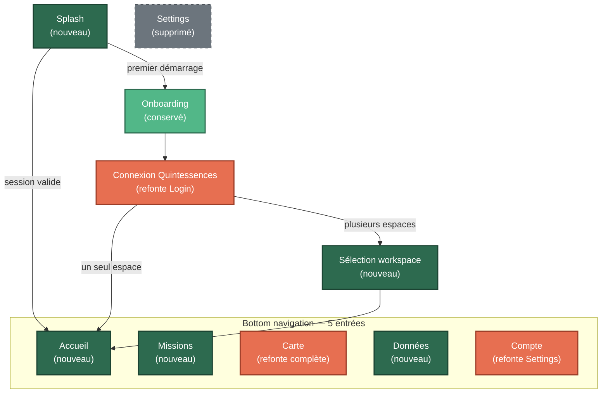

---

## Accueil — tableau de bord et descendants

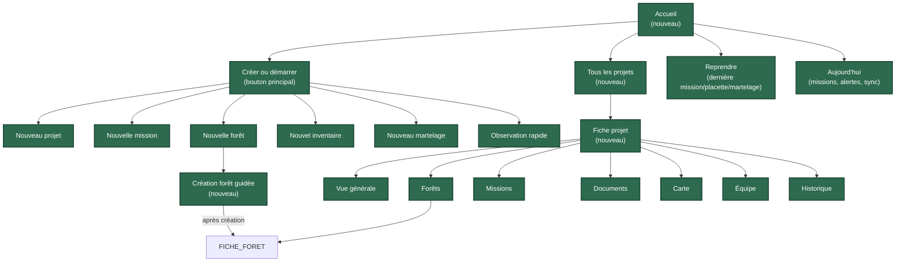

---

## Forêt → Parcelle → Placette → Tige (chaîne canonique)

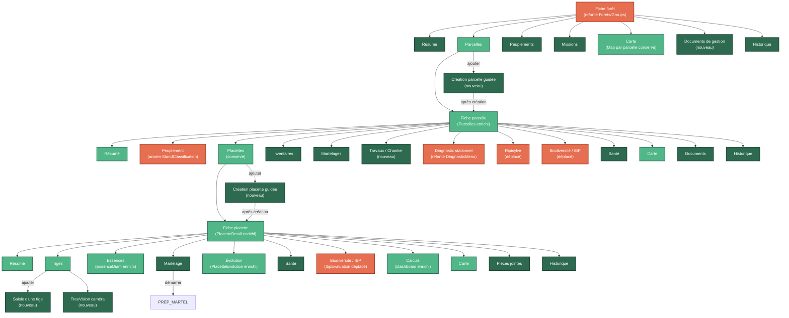

---

## Martelage — saisie → synthèse automatique

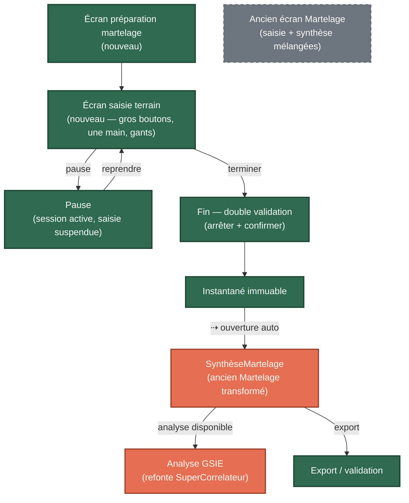

---

## Missions — liste, dashboard, parcours

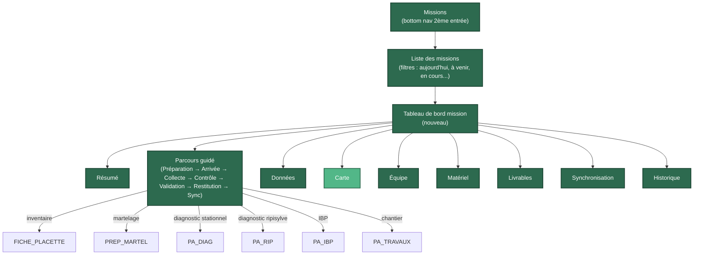

---

## Carte — refonte complète

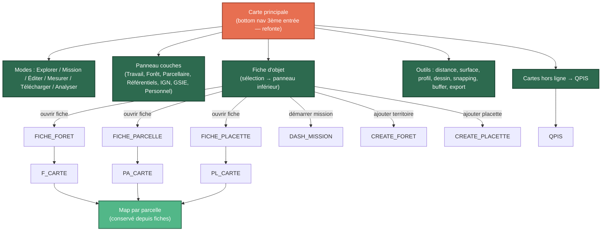

---

## Données — navigateur global

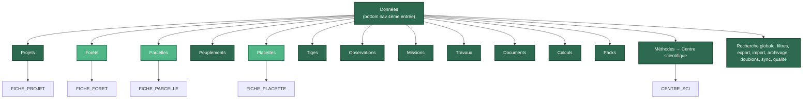

---

## Compte — 16 sections (refonte Settings)

```mermaid
flowchart TD
    COMPTE["Compte<br/>(bottom nav 5ème entrée)"]:::transformed
    SETTINGS_OLD["Settings<br/>(supprimé)"]:::deleted
    ACCOUNT_OLD["Account<br/>(refondu dans Profil)"]:::deleted
    LOGIN_OLD["Login<br/>(refondu en Connexion)"]:::deleted
    PASS_OLD["PasswordRecovery<br/>(refondu dans Sécurité)"]:::deleted

    COMPTE --> C_PROFIL["Profil<br/>(ancien Account refondu)"]:::transformed
    COMPTE --> C_WORKSPACE["Workspace"]:::new
    COMPTE --> C_ORGA["Organisations"]:::new
    COMPTE --> C_ABO["Abonnement"]:::new
    COMPTE --> C_SEC["Sécurité<br/>(passkeys, Google, TOTP, récupération)"]:::transformed
    COMPTE --> C_APPAREILS["Appareils"]:::new
    COMPTE --> C_SYNC["Synchronisation → Centre sync"]:::new
    COMPTE --> C_PACKS["Packs → Gestionnaire QPIS"]:::transformed
    COMPTE --> C_TERRAIN["Terrain<br/>(pluie, gants, gaucher, haptique)"]:::new
    COMPTE --> C_CARTES["Cartes<br/>(fonds, caches, téléchargements)"]:::new
    COMPTE --> C_IA["IA<br/>(modèles, assistant vocal)"]:::new
    COMPTE --> C_CONF["Confidentialité<br/>(ancien PrivacyPolicy)"]:::kept
    COMPTE --> C_ACCESS["Accessibilité"]:::new
    COMPTE --> C_AIDE["Aide → Onboarding"]:::new
    COMPTE --> C_DEV["Développeur<br/>(ancien DeveloperOptions enrichi)"]:::kept
    COMPTE --> C_ABOUT["À propos"]:::new

    C_WORKSPACE --> WORKSPACE
    C_ORGA --> WORKSPACE
    C_SYNC --> CENTRE_SYNC
    C_PACKS --> QPIS
    C_AIDE --> ONBOARD
    C_SEC -->|mot de passe oublié| C_SEC

    classDef new fill:#2d6a4f,color:#fff,stroke:#1b4332,stroke-width:2px
    classDef kept fill:#52b788,color:#fff,stroke:#2d6a4f,stroke-width:2px
    classDef transformed fill:#e76f51,color:#fff,stroke:#9c3d28,stroke-width:2px
    classDef deleted fill:#6c757d,color:#fff,stroke:#495057,stroke-width:1px,stroke-dasharray:5 5
```

---

## Synchronisation, conflits, QPIS, centre scientifique, analyse GSIE

```mermaid
flowchart TD
    CENTRE_SYNC["Centre de synchronisation<br/>(nouveau)"]:::new
    CONFLITS["Résolution des conflits<br/>(nouveau)"]:::new
    QPIS["Gestionnaire QPIS<br/>(refonte PackManager)"]:::transformed
    CENTRE_SCI["Centre scientifique<br/>(ancien TarifDocs enrichi)"]:::transformed
    ANALYSE_GSIE["Analyse GSIE<br/>(refonte SuperCorrelateur)"]:::transformed

    CENTRE_SYNC --> CS_GENERAL["Vue générale"]:::new
    CENTRE_SYNC --> CS_ATTENTE["En attente"]:::new
    CENTRE_SYNC --> CS_ERREURS["Erreurs"]:::new
    CENTRE_SYNC --> CS_CONFLITS["Conflits"]:::new
    CENTRE_SYNC --> CS_APPAREILS["Appareils"]:::new
    CENTRE_SYNC --> CS_HIST["Historique"]:::new

    CS_CONFLITS --> CONFLITS
    CONFLITS -->|garder local / serveur / fusionner / dupliquer / reporter| CS_CONFLITS

    QPIS --> Q_RECOS["Recommandés"]:::new
    QPIS --> Q_INSTALLES["Installés"]:::new
    QPIS --> Q_TERRIT["Territoires"]:::new
    QPIS --> Q_SCIENT["Scientifiques"]:::new
    QPIS --> Q_IA["IA"]:::new
    QPIS --> Q_ORGA["Organisation"]:::new
    QPIS --> Q_STOCK["Stockage"]:::new
    QPIS --> Q_HIST["Historique"]:::new

    CENTRE_SCI --> CS_METHODES["Méthodes installées"]:::new
    CENTRE_SCI --> CS_PAGE["Page méthode<br/>(description, variables, formule, source, territoire, espèces, incertitude)"]:::new
    CENTRE_SCI -->|référence IBP| IBP_REF["IBP Reference<br/>(déplacé)"]:::transformed

    ANALYSE_GSIE --> AG_LOCAL["Analyse locale<br/>(hors ligne)"]:::new
    ANALYSE_GSIE --> AG_GSIE["Analyse GSIE<br/>(moteur, date, version, preuve, incertitude)"]:::new
    ANALYSE_GSIE --> AG_DIAG["Diagnostic"]:::new
    ANALYSE_GSIE --> AG_RECO["Recommandations<br/>(explicables, modifiables, refusables)"]:::new
    ANALYSE_GSIE --> AG_SCEN["Scénarios"]:::new
    ANALYSE_GSIE --> AG_SRC["Sources"]:::new

    SYNTHESE -->|analyse disponible| ANALYSE_GSIE
    PL_CALCULS -->|voir méthode| CENTRE_SCI
    FICHE_PARCELLE -->|analyse| ANALYSE_GSIE

    classDef new fill:#2d6a4f,color:#fff,stroke:#1b4332,stroke-width:2px
    classDef kept fill:#52b788,color:#fff,stroke:#2d6a4f,stroke-width:2px
    classDef transformed fill:#e76f51,color:#fff,stroke:#9c3d28,stroke-width:2px
```

---

## Diagnostics — nouvelle organisation (déplacés)

```mermaid
flowchart TD
    subgraph AVANT["Avant — NavGraphs séparés"]
        DIAG_MENU_OLD["DiagnosticMenu<br/>(route séparée)"]:::deleted
        DIAG_RESULT_OLD["DiagnosticResult<br/>(route séparée)"]:::deleted
        RIP_OLD["RipisylveDiagnostic<br/>(route séparée)"]:::deleted
        RIP_STD_OLD["RipisylveStandalone<br/>(route séparée)"]:::deleted
        IBP_PROJ_OLD["IbpProjects<br/>(route séparée)"]:::deleted
        IBP_STD_OLD["IbpStandalone<br/>(route séparée)"]:::deleted
        IBP_HIST_OLD["IbpHistory<br/>(route séparée)"]:::deleted
        IBP_EVAL_OLD["IbpEvaluation<br/>(route séparée)"]:::deleted
        IBP_REF_OLD["IbpReference<br/>(route séparée)"]:::deleted
        IBP_DIAG_OLD["IbpDiagnostic<br/>(route séparée)"]:::deleted
        IBP_CMP_OLD["IbpCompare<br/>(route séparée)"]:::deleted
    end

    subgraph APRES["Après — onglets fiches + protocoles missions"]
        PA_DIAG["Fiche parcelle > Diagnostic stationnel<br/>(onglet — refonte)"]:::transformed
        PA_RIP["Fiche parcelle > Ripisylve<br/>(onglet — déplacé)"]:::transformed
        PA_IBP["Fiche parcelle > Biodiversité / IBP<br/>(onglet — déplacé)"]:::transformed
        PL_BIO["Fiche placette > Biodiversité / IBP<br/>(sous-onglet — IbpEvaluation déplacé)"]:::transformed
        M_DIAG["Mission > Diagnostic stationnel<br/>(protocole Mission Engine)"]:::new
        M_RIP["Mission > Diagnostic ripisylve<br/>(protocole Mission Engine)"]:::new
        M_IBP["Mission > IBP<br/>(protocole Mission Engine)"]:::new
        IBP_REF["Centre scientifique > IBP Reference<br/>(déplacé)"]:::transformed
    end

    DIAG_MENU_OLD -.->|devient| PA_DIAG
    DIAG_RESULT_OLD -.->|devient| PA_DIAG
    RIP_OLD -.->|devient| PA_RIP
    RIP_STD_OLD -.->|devient| M_RIP
    IBP_PROJ_OLD -.->|devient| M_IBP
    IBP_STD_OLD -.->|devient| M_IBP
    IBP_HIST_OLD -.->|devient| PA_IBP
    IBP_EVAL_OLD -.->|devient| PL_BIO
    IBP_REF_OLD -.->|devient| IBP_REF
    IBP_DIAG_OLD -.->|devient| PA_IBP
    IBP_CMP_OLD -.->|devient| PL_BIO

    classDef new fill:#2d6a4f,color:#fff,stroke:#1b4332,stroke-width:2px
    classDef kept fill:#52b788,color:#fff,stroke:#2d6a4f,stroke-width:2px
    classDef transformed fill:#e76f51,color:#fff,stroke:#9c3d28,stroke-width:2px
    classDef deleted fill:#6c757d,color:#fff,stroke:#495057,stroke-width:1px,stroke-dasharray:5 5
```

---

## TreeVision, Travaux, Documents

```mermaid
flowchart TD
    TREEVISION["TreeVision caméra<br/>(nouveau — expérimental)"]:::new
    TV_RESULT["Page résultat TreeVision<br/>(diamètre, hauteur, incertitude, confiance)"]:::new

    TREEVISION -->|valider| TV_RESULT
    TV_RESULT -->|corriger| SAISIE_TIGE
    SAISIE_TIGE -->|mesurer caméra| TREEVISION

    PA_TRAVAUX["Chantier travaux<br/>(nouveau)"]:::new
    PA_TRAVAUX --> T_PRESC["Prescription"]:::new
    PA_TRAVAUX --> T_PLAN["Planification"]:::new
    PA_TRAVAUX --> T_CARTE["Carte"]:::kept
    PA_TRAVAUX --> T_EXEC["Exécution"]:::new
    PA_TRAVAUX --> T_CTRL["Contrôle"]:::new
    PA_TRAVAUX --> T_RECEPT["Réception"]:::new
    PA_TRAVAUX --> T_DOCS["Documents"]:::new
    PA_TRAVAUX --> T_HIST["Historique"]:::new

    F_DOCS["Documents de gestion<br/>(nouveau)"]:::new
    F_DOCS --> DOC_PSG["PSG"]:::new
    F_DOCS --> DOC_AMEN["Aménagement"]:::new
    F_DOCS --> DOC_COUPE["Programme de coupes"]:::new
    F_DOCS --> DOC_TRAV["Programme de travaux"]:::new
    F_DOCS --> DOC_CARTES["Cartes"]:::new
    F_DOCS --> DOC_BILAN["Bilans"]:::new
    F_DOCS --> DOC_AVEN["Avenants"]:::new

    classDef new fill:#2d6a4f,color:#fff,stroke:#1b4332,stroke-width:2px
    classDef kept fill:#52b788,color:#fff,stroke:#2d6a4f,stroke-width:2px
    classDef transformed fill:#e76f51,color:#fff,stroke:#9c3d28,stroke-width:2px
```

---

## Vue globale — toutes les pages sur un seul graphe

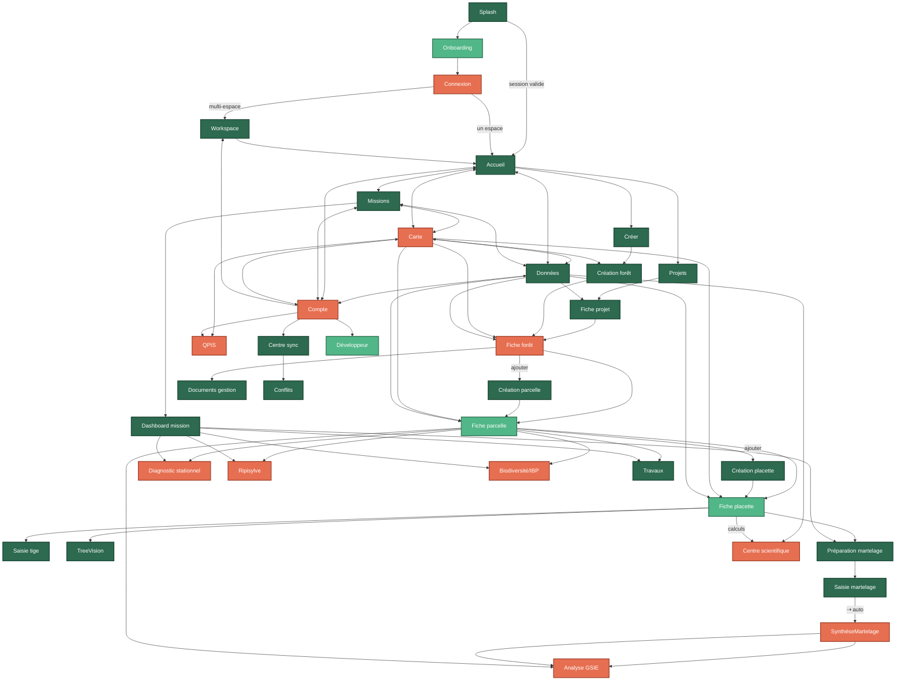

---

## Récapitulatif — compteurs

| Catégorie | Nombre | Couleur |
|---|---|---|
| **Conservés** (enrichis) | 18 | Vert |
| **Transformés** | 10 | Orange |
| **Nouveaux** | 21 | Bleu foncé |
| **Supprimés** (référence) | 4 | Gris pointillé |
| **Total pages v0.8.0** | 49 actives | — |
| **Total routes v0.7.0** | 27 | — |
